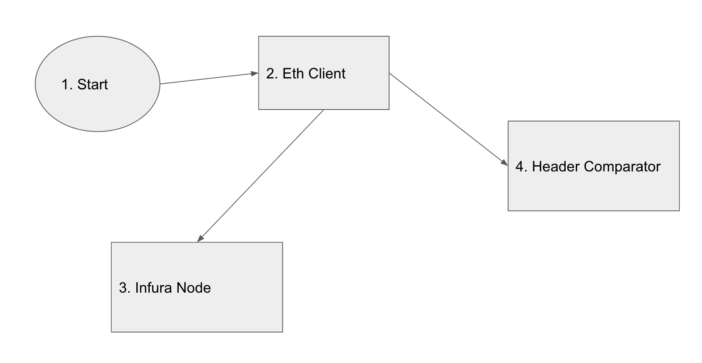

# CRT Architecture

## Problem Statement

The Ethereum network has a target block time of 15s. Turns out, many things can go
wrong in those 15s.

For example, when an Ethereum node realizes that it doesn't have the correct version
of the main (canonical) chain, the transactions in the latter part of its chain (i.e. the
most recent transactions) are reverted and the transactions in the newer,
replacement chain, are executed.

Given the short target block time, this happens rather often. Because it takes time for
the blocks to propagate through the network, it’s easy for different parts of the
network to have a different final block (or two, or perhaps even three) in normal
operation since the miners often come up with them at roughly the same time.

These are called ephemeral forks, and trigger chain reorganization.

Your task is to build a chain reorganization tracker (that runs in the command line),
that can identify when a reorganization event takes place on the blockchain, as well
as find out which blocks were part of the discarded ephemeral fork.

## Solution

* `Infura Node`: Acts as Validator on the Ethereum blockchain. 
* `Eth Client`: Helps in communication with Infura Node. 
* `Header Comparator`: Identifies Forked block.

Communication between above entities are shown in below diagram .

### Infura Node

Infura runs a validator on ethereum and it helps us in fetching info on ethereum blockchain.\
So get Url and Key to interact with the infura node. we need wss as we will be using subscription.

### Eth Client

Use ethclient to connect to Infura Node.\
Use SubscribeNewHead function on client connection and pass header channel to it.

### Header Comparator

channels are used for asynchronous communication.\
select helps us to wait on multiple channels.\
So we will wait for infinite time untill error happens in connection.\
When a header is received we compare its number with previous one. If both are equal and hash for blocks differs then fork has happened and infura validator needs to update its chain with new block.
