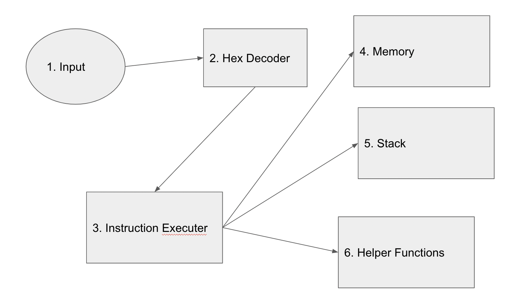

# EVM Architecture

## Problem Statement

In the year 2092, as humanity is slowly going extinct, you are part of civilization’s last
ditch effort to preserve the human race. Governments have employed you, as well as
several other developers on a voyage mission into deep space.\

When passing Neptune, the computer aboard your space ship malfunctions, leaving
your crew stranded.\

The computer is an Ethereum Virtual Machine (EVM).\
Being the only blockchain developer on board, your task is to build a small, but
working EVM, capable of reading and executing a small set of instructions

INSTRUCTION                       DESCRIPTION                     GAS

PUSH1 / PUSH2 / PUSH3 / PUSH32    Pushes a value to the stack      3\
MSTORE / MSTORE8                  Stores a value in memory,\
                                  with the corresponding offset    3*\
ADD                               Adds the last 2 values on the    3\
                                  stack \
MUL                               Multiplies the last 2 values on  5\
                                  the stack \
SDIV                              Signed division of the last 2    5\
                                  values on the stack \
EXP                               Exponentiation of the last 2     50*\
                                  values on the stack

You will find examples that use these instructions on the following page. Each
example is provided with the instruction bytecode, estimated gas usage, as well as
the keccak256 hash of the memory after execution.\
The notes section contains the corresponding opcodes in Ethereum.

EXAMPLE #1:\
BYTECODE : 60016020526002606452600361ff0052600362ffffff526005601053\ 
KECCAK256 : ab2744998886b708acadc0a32428d0aa1953e83924383d21c6de5dac852ccbcc \
GAS CONSUMED : 538445872 

EXAMPLE #2:\
BYTECODE : 7fffffffffffffffffffffffffffffffffffffffffffffffffffffffffffffffff7ffffffffffffffffff\
fffffffffffffffffffffffffffffffffffffffffffff00016000527fffffffffffffffffffffffff\
ffffffffffffffffffffffffffffffffffffff007ffffffffffffffffffffffffffffffffffffffffffff\
fffffffffffffffffff00026020527fffffffffffffffffffffffffffffffffffffffffffffffffff\
ffffffffffffff7ffffffffffffffffffffffffffffffffffffffffffffffffffffffffffffff\
fff05604052\
KECCAK256 : b9a07dba38aa24923a611fced9d2eede3bfbfa281e5e498d60f4bd99e5ce6a15 \
GAS CONSUMED : 58 

EXAMPLE #3:\
BYTECODE : 7fffffffffffffffffffffffffffffffffffffffffffffffffffffffffffffffff7fffffffffffffffff
ffffffffffffffffffffffffffffffffffffffffffffff000a6000527fffffffffffffffffffff
ffffffffffffffffffffffffffffffffffffffffff007ffffffffffffffffffffffffffffffffffffff
fffffffffffffffffffffffff000a6020527fffffffffffffffffffffffffffffffffffffffffff
ffffffffffffffffffffff7fffffffffffffffffffffffffffffffffffffffffffffffffffffffffffff
ffff0a604052\
KECCAK256 : afe1e714d2cd3ed5b0fa0a04ee95cd564b955ab8661c5665588758b48b66e263\ 
GAS CONSUMED : 4875 

The EXP and MSTORE instructions have dynamic pricing:\
EXP gas price is calculated using the following formula:\
50 * byteLength\
Where byteLength is the byte length of the exponent in the operation

For the MSTORE:

1.Figure the new size of the memory (expansion)\
2.Figure out how many words (1 word == 256 bits) there are in the new memory\
3.Use this formula for the newCost = 3*w+w*w/512\
4. cost = newCost - the last cost you paid for the memory expansion (lastCost)\
5. lastCost = cost (you store this somewhere for future memory expansions)\
* This is how much gas your operation should consume
Opcode usage example:\
Firstly find the row, then the column.\
- STOP       0x00   R: 0, C: 0\
- PUSH1 0x01 0x6001 R: 6, C: 0\
- SHA3       0x20   R: 2, C: 0\
- MSTORE     0x52   R: 5, C: 2\
- ADD        0x01   R: 0, C: 1

## Solution

* `Input`: given as a string in hex form. 
* `Decoder`: converts hex string to byte array. 
* `Memory`: Recursion needed as there can be strings or list inside a list any no.of times.
* `Stack`: identifies the type(List or string or character ) based on the first byte.
* `Instructions Executer`: used to parse length or string from byte array.
* `Helper Functions`: used to parse length or string from byte array.


Communication between above entities are shown in below diagram .



### Input
In hex form each charater occupies 4 bits , it needs to be read as string from cli. 

### Decoder
Decoder receives the input.\
In order to make comparisions of first byte , we need our input to be in form of byte array . 
```go
func findSolution(inputString string) (uint64, Stack, Memory, string) {

}
```

### Memory
Memory is used to store data , when Mstore , Mstore8 operations are executed \
Set function is used by Mstore8 \
Set32 function is used by Mstore 
```go

// Set sets offset + size to value
func (m *Memory) Set(offset, size uint64, value []byte) int {

}
// Set32 sets the 32 bytes starting at offset to the value of val, left-padded with zeroes to
// 32 bytes.
func (m *Memory) Set32(offset uint64, val *uint256.Int) int {

}
```

### Stack
Stack is used to push data and pop data, when PUSH variants and all other operations executed \

```go

func (st *Stack) push(d *uint256.Int) {
	// NOTE push limit (1024) is checked in baseCheck
	st.data = append(st.data, *d)
}

func (st *Stack) pop() (ret uint256.Int) {
	ret = st.data[len(st.data)-1]
	st.data = st.data[:len(st.data)-1]
	return
}

```

### Instructions Executer

Initializes empty stack and memory at the start \
Initializes totalGas and lastgascost as zero \ 
executes the instruction based on opcode \
lastgascost helps in calculating the gas for memory expansion\
At the end returns total gas, stack and memory\
each instruction consumes static gas.\
dynamic gas depends on type of instruction
```go
func solve(input []byte) (uint64, Stack, Memory) {

}
```

### Helper Functions

findHash function helps in calculating hash of memory or a byte byteArray\
calcMemSize64WithUint helps in calculating size of memory required to fit new bytes.
```go
func findHash(memory []byte) common.Hash {

}
func calcMemSize64WithUint(off *uint256.Int, length64 uint64) (uint64, bool) {

}
```