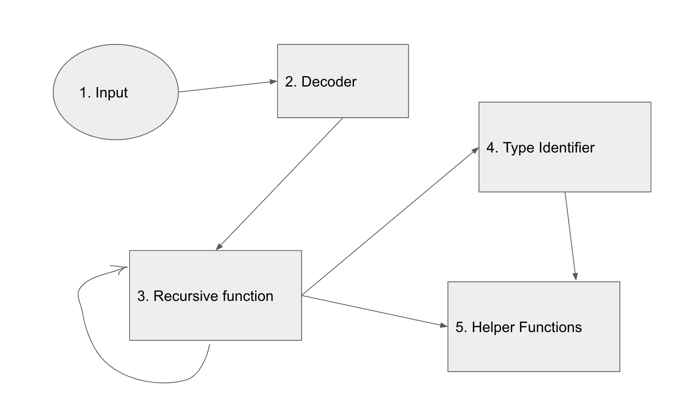

# RLP Architecture

## Problem Statement

You have intercepted some very cryptic messages on dark web chat rooms. The
messages are RLP encoded and are believed to contain the latitude and longitude
coordinates of Nikola Tesla's hidden treasure, as well as the possible real names of
Satoshi Nakamoto.\
In order to decipher the messages you need to write an RLP decoder, capable of
decoding any RLP encoded message, and to display it in the following format (in the
command line):\
List {\
    List{\
        ...\
    }\
    String <value>\
}\
Sources close to the dark web hackers say that only strings and lists of strings are
present in the messages.\
Intercepted messages\
#1:
ed90416e616e746861204b726973686e616e8d526168756c204c656e6b616c618d47616e65736820507261736164\
#2:
e5922034342e38313538393735343033373334319132302e3435343733343334343535353435


## Solution

* `Input`: given as a string in hex form. 
* `Decoder`: converts hex string to byte array. 
* `Recursive Function`: Recursion needed as there can be strings or list inside a list any no.of times.
* `Type Identifier`: identifies the type(List or string or character ) based on the first byte.
* `Helper Functions`: used to parse integer or string from byte array.

Communication between above entities are shown in below diagram .



### Input
In hex form each charater occupies 4 bits , it needs to be read as string from cli. 

### Decoder
Decoder receives the input.\
In order to make comparisions of first byte , we need our input to be in form of byte array . 
```go
func findSolution(inputString string) string {

}
```

### Recursive function 
Recursive function traverses byte array.\
This function traverses the byte array untill it is completed . It uses Type Identifier to identify type of data like string or list or character , offset tells starting index of data and length tells the length of data from offset.

Base case to stop this function is when length of input is zero . After parsing the respective type data it calls itself. 
```go
func extractStringsAndList(input []byte) string {

}
```

### Type Identifier
This function returns offset, length, type of data . return an error if input is malformed . \
If first byte is
* 0x00 - 0x7f -> character 
* 0x80 - 0xb7 -> string , length of data calculated as (byte-0xb7)
* 0xb8 - 0xbf -> string , length of data follows type
* 0xc0 - 0xf7 -> list length of data calculated as (byte-0xc0)
* 0xf8 - 0xff -> list , length of data follows type
```go
func identifyType(input []byte) (offset uint64, length uint64, Type uint64, err error) {

}
```

### Helper Functions

extractIntFromByteArray returns integer , given byte array and start of data and length of data.\
extractStringFromByteArray returns string , given byte array and start of data and length of data.  
```go
func extractIntFromByteArray(input []byte, start, length uint64) (len uint64) {
	slice := input[start:(start + length)]
	strLen := big.NewInt(0).SetBytes(slice).Uint64()

	return strLen
}
func extractStringFromByteArray(input []byte, start, length uint64) (res string) {
	result := string(input)[start:(start + length)]
	return result
}
```